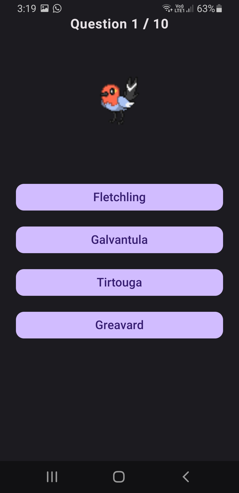
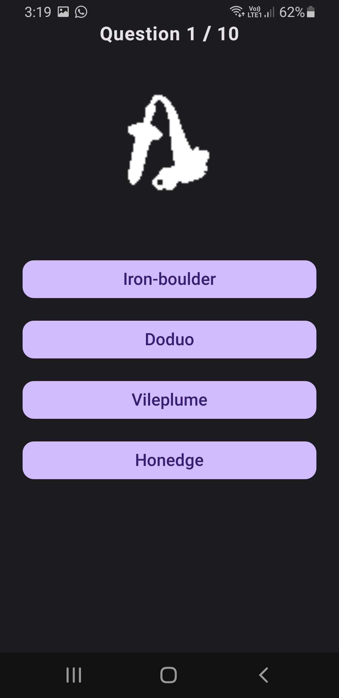

# Pokémon Quiz

Pokémon Quiz is a fan-made mobile quiz app that tests your knowledge of Pokémon. The app is purely for entertainment purposes and is not affiliated with Nintendo, Game Freak, or The Pokémon Company.

## Features

🎮 Multiple difficulty levels: Easy, Medium, Hard, Very Hard

🏆 Track your high scores locally

🖼️ Pokémon images for each question

Able to select generation depending on your pokemon knowledge

Medium difficulty: blurred images

Hard difficulty : blacked-out images

Very Hard difficulty: Scrambled Pokemon Names

💾 All data stored locally on the device

🖤 Fan-made and free to play

## Screenshots

## Installation

Download the apk from releases and install on your device

## Usage

Select a difficulty on the home screen

Answer 10 Pokémon questions per quiz

Track your high scores per difficulty level

Unlock higher difficulties by scoring perfect on the previous one

## Disclaimer

This app is a fan-made quiz for entertainment purposes only. It is not affiliated with, endorsed by, or connected to Nintendo, Game Freak, or The Pokémon Company. All Pokémon names, images, and content are copyrighted by their respective owners.

## Contributing

Contributions are welcome! Feel free to submit issues or pull requests.

## License

This project is for entertainment purposes only. Do not use for commercial purposes.
